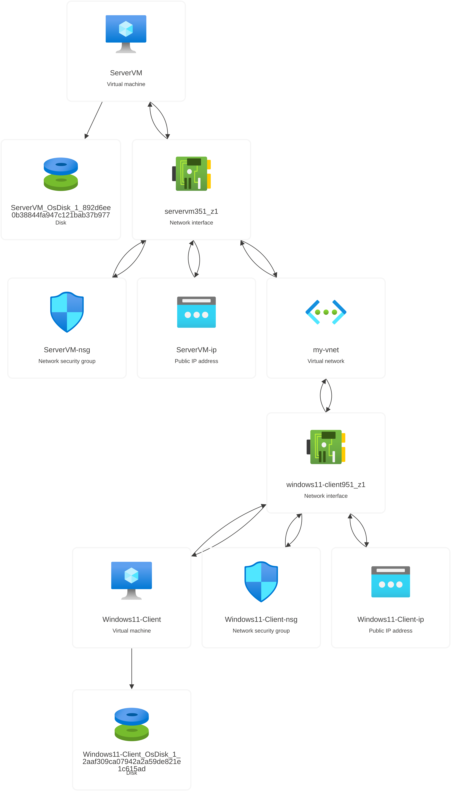

# Azure Network Diagram

### 🚀 Overview
This project demonstrates a multi-VM cloud environment built on Microsoft Azure, designed to simulate a basic enterprise network with segmented client and server infrastructure. It showcases hands-on experience with core Azure networking and compute concepts.

### Architecture
The lab consists of two virtual machines connected through a shared virtual network (my-vnet), each with dedicated networking and security resources:
- ServerVM (Server Node)
- Windows11 - Client (Client Computer)

### What Was Built
- Provisioned 2 VMs (1 server, 1 client) inside a shared Azure Virtual Network
- Configured Network Interface Cards (NICs) for each VM to enable internal communication
- Assigned Public IP addresses to each machine for remote access
- Applied Network Security Groups (NSGs) to control inbound/outbound traffic rules
- Attached managed OS disks to each VM for persistent storage
- Established bidirectional connectivity between the server and client nodes through the virtual network

### Skills Demonstrated
- Azure Virtual Machine provisioning
- Virtual Network (VNet) design and subnetting
- Network Security Group (NSG) rule configuration
